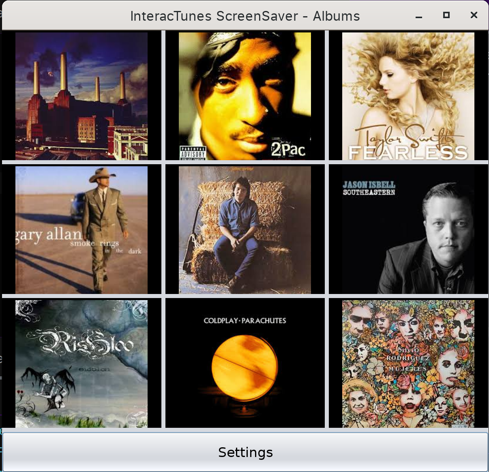
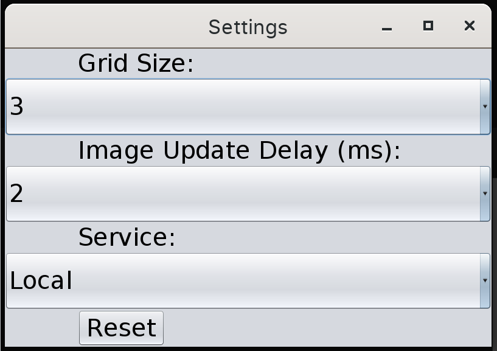

# InteracTunes ScreenSaver

This is a simple screen saver app written in Java Swing. It displays images (mostly album covers) in a grid, and in an 
interval an image is replaced by another.

This project is built as a part of the interview process for the Junior Java (Cloud) Developer position at Rocket Partners.

# Setting up the app

1. Clone the repository
2. Open the project in your favorite IDE (preferably IntelliJ IDEA)
3. Change the name of the '.env.example' file in the root directory to '.env' and set the value of the env vars
4. Run the main method which can be found in the `src/main/java/org/interactunes/screensaver/AppLauncher.java` file

# Running the app

The app requires Java 17. If you do not already have Java 17 installed, you will need to do so before running this app. 
You can run the app by running the main method in the `AppLauncher.java` file.

# Features

The app displays images in a grid

Settings are contained in a separate window that can be opened by clicking the settings button.

The "Service" option in the settings window allows you to choose between the "Local" and "Discog" services. The Discog service requires that the API key and secret env vars be set.

# Limitations / Issues
- There is a limit to the number of requests that the Discog service can make in a given amount of time. When the limit is reached, a 429 error is returned. ~~This is not handled in the app and therefore the app will freeze due to the input stream not being closed. This should be fixed if given more time.~~ The app falls back to the local service when the Discog service is rate limited.
- The app does not handle the case where the user enters an invalid API key or secret. This should be fixed if given more time.
- Font and window size is not reliably consistent across platforms. I use Linux for my personal laptop, and on this device, the windows and font sizes seem good. However, when I load the app on a Windows laptop, the window and font sizes are incredibly large.
- The images returned from the Discogs API mostly suck. At least as far as I've seen, there's not a good way to fetch simply album covers, so instead the images end up mostly being pictures of the artists themselves.
